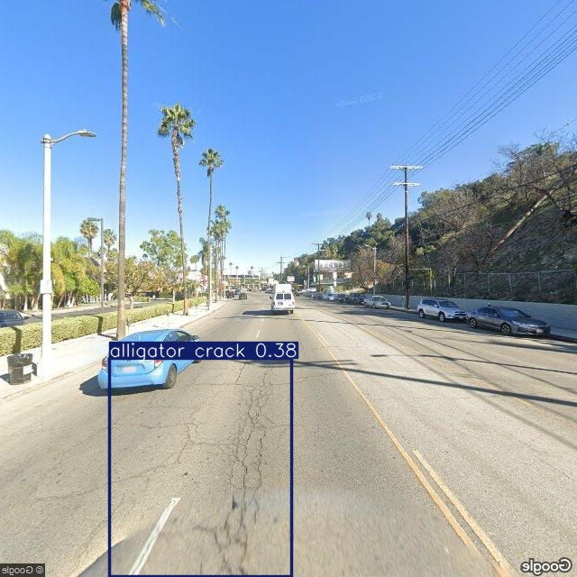
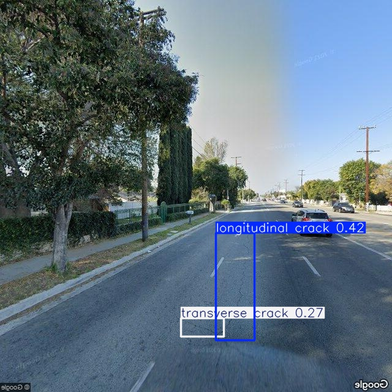

# 🚗 Road Damage Detection avec YOLOv8

Ce projet utilise le modèle **YOLOv8** pour détecter automatiquement les défauts sur les routes à partir d’images.  
L’objectif est de former un modèle capable d’identifier différents types de fissures ou dégradations routières, puis de l’utiliser pour prédire sur de nouvelles images.

Lien du dataset : [Lien Kaggle](https://www.kaggle.com/datasets/juusos/rdd2022es/data)

---

## 📂 Structure du projet

📁 RoadDamageDetection/
│
├── 📂 data/ # Dataset brut (non inclus dans le repo, à télécharger)
├── 📂 dataset/ # Dataset splitté (non inclus dans le repo, à télécharger)
│ ├── images/ # Images d'entraînement et de test
│ └── labels/ # Labels YOLO format .txt
│
├── 📂 models/ # sauvegarde perso des models entraînés
│
├── 📂 scripts/ # Scripts Python
│ ├── train_model_rdd.py # Script d'entraînement du modèle
│ ├── yolov8n.pt # modèle YOLO
│ └── runs/ # Résultats YOLO (entraînement, prédictions)
│
├── .gitignore # Fichiers/dossiers à ignorer par Git
├── README.md # Ce fichier 
└── data.yaml # Configuration YOLO pour le dataset

---

## 📌 Améliorations possibles

- 🔧 Optimiser les hyperparamètres (epochs, imgsz, batch…)

- 🧠 Tester des modèles plus grands (yolov8s, yolov8m)

- 🌍 Déployer le modèle en API avec FastAPI

- 💻 Support GPU avec CUDA ou ROCm pour accélérer l’entraînement

---

## Galerie

- Exemple 1 : Fissures détectées

  

- Exemple 2 : Nid de poule

  

- Exemple 3 : Multiples défauts

  

- Exemple 4 : Résultat en lot (batch de prédictions)

  

